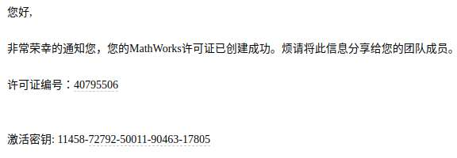

# 在不重装matlab的前提下解决了Matlab的license过期问题（License Manager Error -114）

## 获取新的License

matlab官方对部分学生竞赛会提供软件支持，可以据此申请免费的License，我的License是数模国赛的，有效期半年。

### 申请

[https://www.mathworks.com/academia/student-competitions/cumcm.html](https://www.mathworks.com/academia/student-competitions/cumcm.html) 点击Request software,根据提示填写有效信息，最好用学校的学生邮箱申请哦～

### 等待邮件

吐槽一下，matlab官方说好的3个工作日内给我回信，结果我学完并考完科目二了才收到邮件，等到花儿都谢了，嘤嘤嘤！



### 将新的License与Matlab账户关联

复制邮件中的激活密钥,去这里--&gt; [https://www.mathworks.com/mwaccount/](https://www.mathworks.com/mwaccount/)

## 下载License file

### get host id

```bash
$ /sbin/ifconfig 
```

找到类似这样的字样：

```text
ether 82:78:24:c7:6a:57
```

 后面那那串数字就是你的host ID。

### 后续步骤

[https://www.mathworks.com/matlabcentral/answers/105860-how-do-i-install-or-update-the-network-license-manager](https://www.mathworks.com/matlabcentral/answers/105860-how-do-i-install-or-update-the-network-license-manager)

## 将License file放进对应文件夹

默认路径是： 

```bash
/usr/local/MATLAB/R2019a/licenses
```

## 启动Matlab

```bash
$ cd /usr/local/MATLAB/R2019a/bin
$ ./matlab
```

## 在Matlab软件界面里更新License

[https://www.mathworks.com/matlabcentral/answers/96751-how-do-i-update-my-matlab-license-file-for-an-individual-or-designated-computer-license](https://www.mathworks.com/matlabcentral/answers/96751-how-do-i-update-my-matlab-license-file-for-an-individual-or-designated-computer-license)


写在最后：个人感觉 MATLAB for Linux 真的不如 MATLAB for Windows 好用，哭泣。

